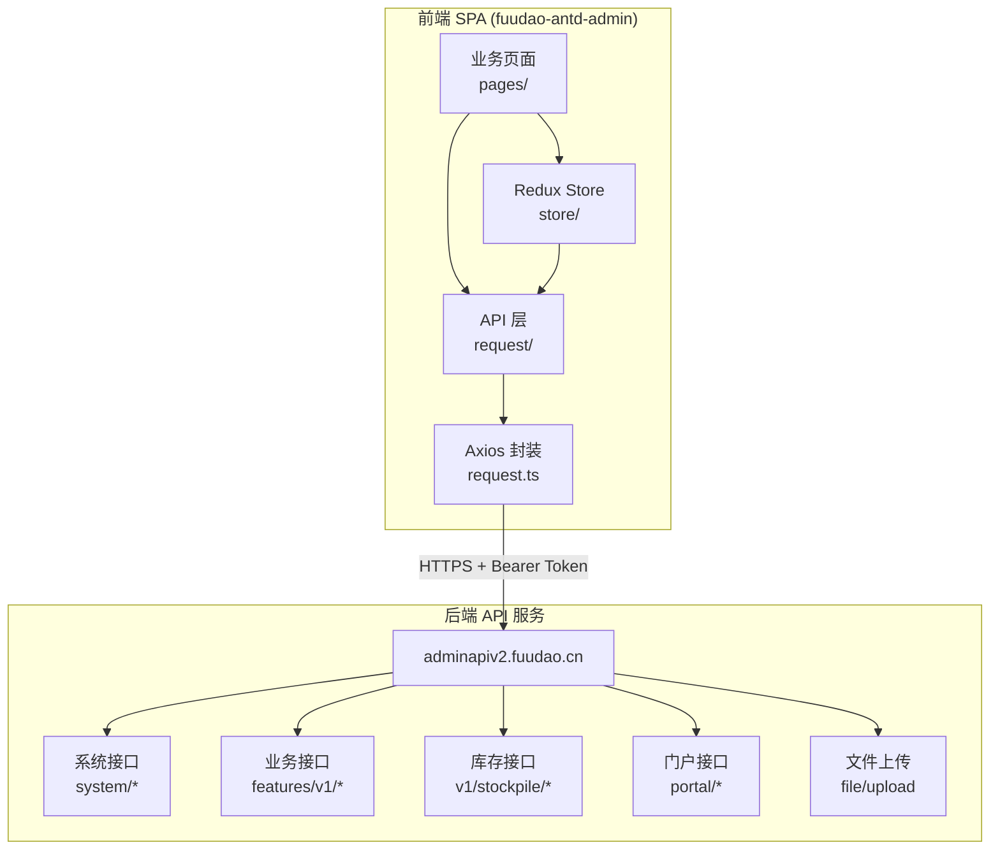
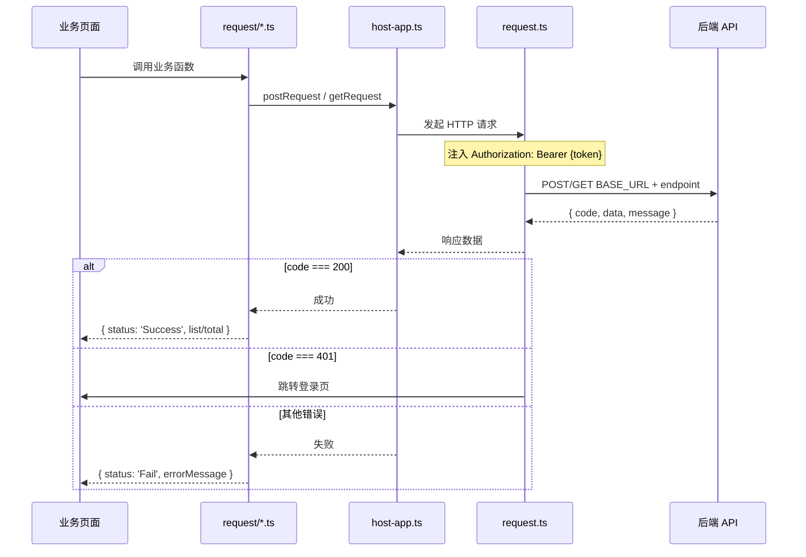
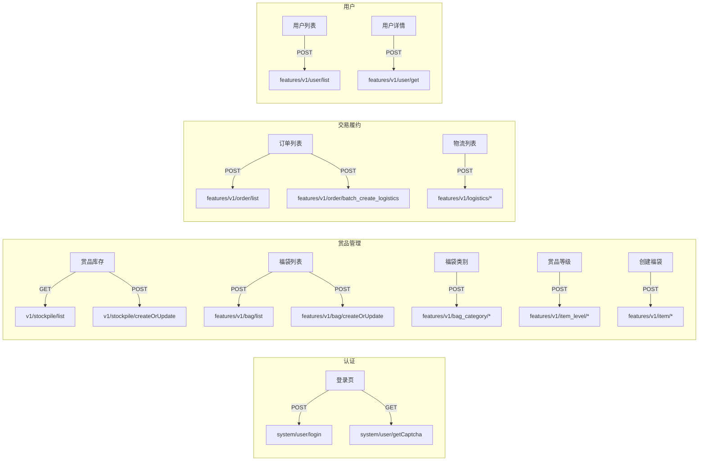
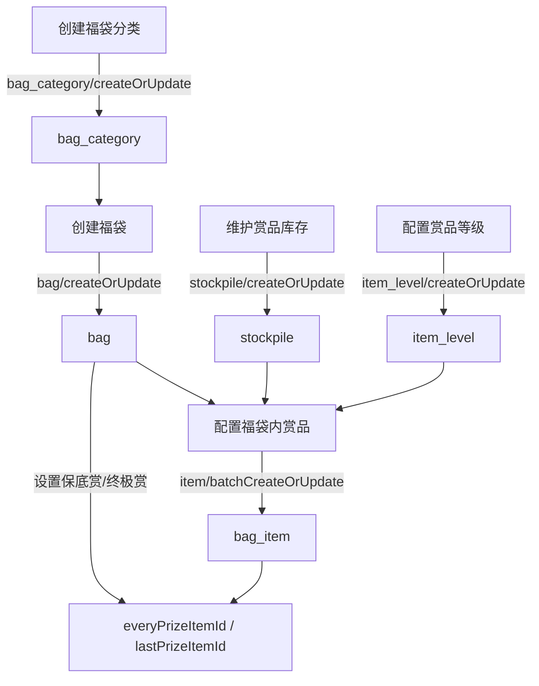
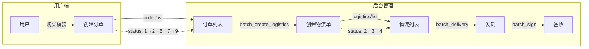
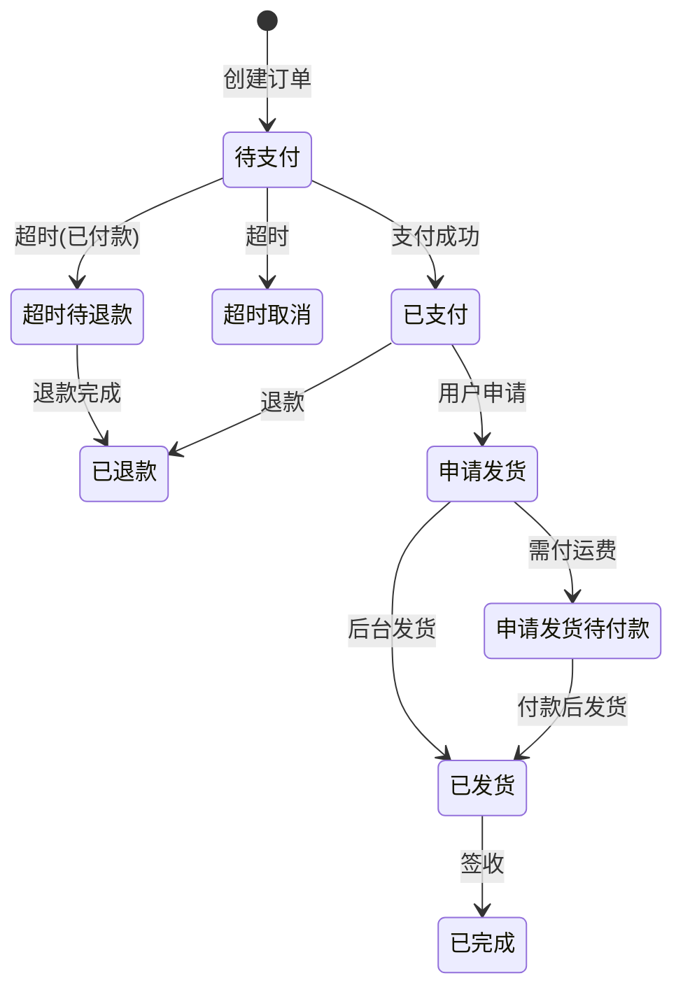
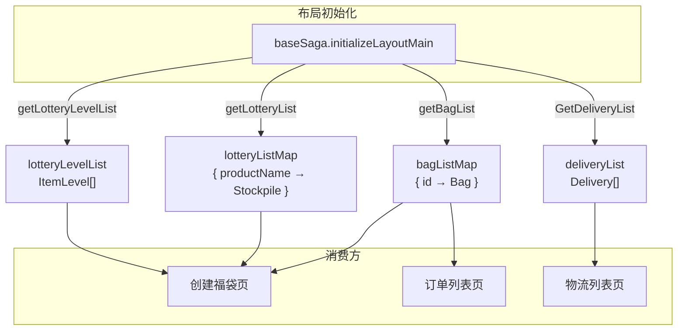
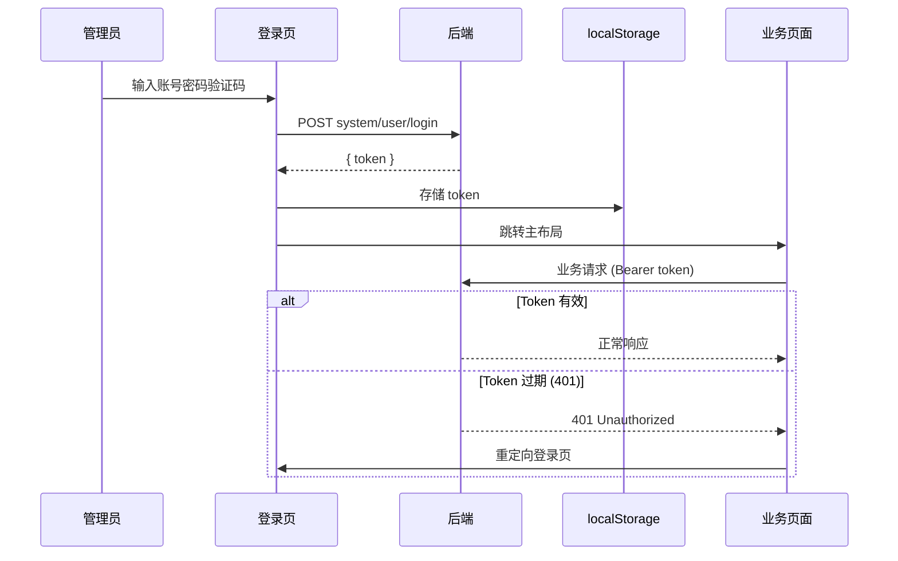
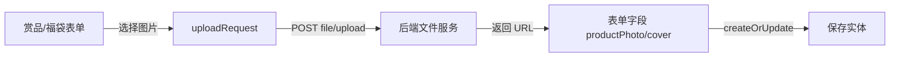

# 数据交互拓扑

## 1. 系统架构总览



## 2. 请求链路



### 响应格式

**新业务接口：**
```json
{
  "code": 200,
  "data": { "total": 100, "lists": [...] },
  "message": "success"
}
```

**遗留 Portal 接口：**
```json
{
  "json_ok": true,
  "json_msg": "success",
  "values": {}
}
```

## 3. API 端点与页面对应关系



## 4. 完整 API 端点清单

### 4.1 系统/认证

| 端点 | 方法 | 用途 | 调用方 |
|------|------|------|--------|
| `system/user/login` | POST | 用户登录 | 登录页 |
| `system/user/getCaptcha` | GET | 获取验证码 | 登录页 |
| `/logout` | POST | 退出登录 | 布局头部 |
| `portal/pingLogin` | POST | 心跳保活 | 登录后（已禁用） |
| `portal/getUserConfigValues` | POST | 读取用户配置 | 遗留 |
| `portal/setUserConfigValue` | POST | 写入用户配置 | 遗留 |
| `file/upload` | POST | 文件上传 | 赏品/福袋图片上传 |

### 4.2 赏品库存

| 端点 | 方法 | 用途 | 调用方 |
|------|------|------|--------|
| `v1/stockpile/list` | GET | 库存列表 | 赏品库存页、Redux 预加载 |
| `v1/stockpile/createOrUpdate` | POST | 创建/编辑库存 | 赏品库存页 |

### 4.3 福袋管理

| 端点 | 方法 | 用途 | 调用方 |
|------|------|------|--------|
| `features/v1/bag/list` | POST | 福袋列表 | 福袋列表页、Redux 预加载 |
| `features/v1/bag/createOrUpdate` | POST | 创建/编辑福袋 | 福袋列表页、创建福袋页 |
| `features/v1/bag_category/list` | POST | 分类列表 | 福袋类别页 |
| `features/v1/bag_category/createOrUpdate` | POST | 创建/编辑分类 | 福袋类别页 |

### 4.4 赏品等级与福袋内赏品

| 端点 | 方法 | 用途 | 调用方 |
|------|------|------|--------|
| `features/v1/item_level/list` | POST | 等级列表 | 赏品等级页、Redux 预加载 |
| `features/v1/item_level/createOrUpdate` | POST | 创建/编辑等级 | 赏品等级页 |
| `features/v1/item_level/delete` | POST | 删除等级 | 赏品等级页 |
| `features/v1/item/list` | POST | 福袋内赏品列表 | 创建福袋页 |
| `features/v1/item/createOrUpdate` | POST | 创建/编辑赏品 | 创建福袋页 |
| `features/v1/item/batchCreateOrUpdate` | POST | 批量创建/编辑 | 创建福袋页 |
| `features/v1/item/delete` | POST | 删除赏品 | 创建福袋页 |

### 4.5 订单

| 端点 | 方法 | 用途 | 调用方 |
|------|------|------|--------|
| `features/v1/order/list` | POST | 订单列表 | 订单列表页 |
| `features/v1/order/createOrUpdate` | POST | 编辑订单 | 订单列表页 |
| `features/v1/order/batch_create_logistics` | POST | 批量创建物流单 | 订单列表页 |

### 4.6 物流

| 端点 | 方法 | 用途 | 调用方 |
|------|------|------|--------|
| `features/v1/logistics/list` | POST | 物流列表 | 物流列表页 |
| `features/v1/logistics/update` | POST | 更新物流单 | 物流列表页 |
| `features/v1/logistics/batch_delivery` | POST | 批量发货 | 物流列表页 |
| `features/v1/logistics/batch_sign` | POST | 批量签收 | 物流列表页 |
| `features/v1/logistics/export` | POST | 导出物流数据 | 物流列表页 |
| `features/v1/logistics/delivery` | POST | 快递公司列表 | Redux 预加载、物流页 |

### 4.7 用户

| 端点 | 方法 | 用途 | 调用方 |
|------|------|------|--------|
| `features/v1/user/list` | POST | 用户列表 | 用户列表页 |
| `features/v1/user/get` | POST | 用户详情 | 用户详情页 |

## 5. 实体数据流

### 5.1 福袋配置流程



### 5.2 交易履约流程



### 5.3 订单状态流转



## 6. Redux 全局缓存拓扑



## 7. 认证与鉴权流



## 8. 文件上传流


